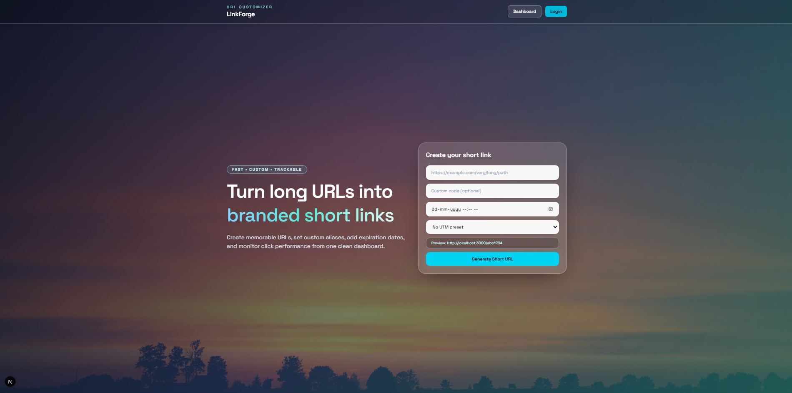
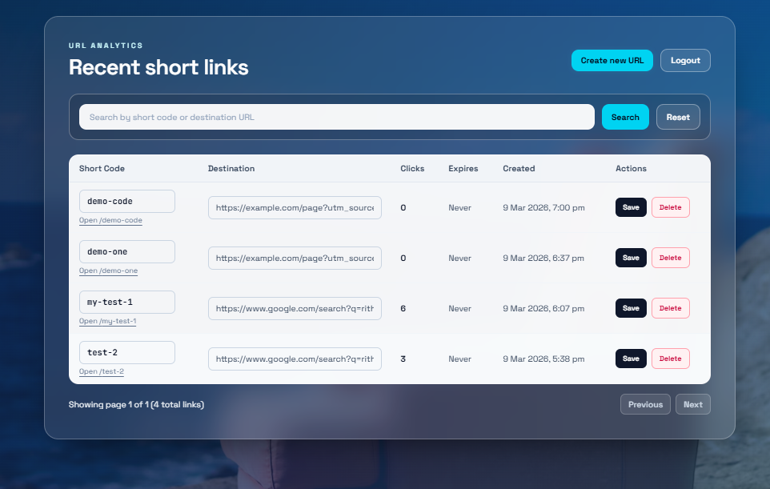
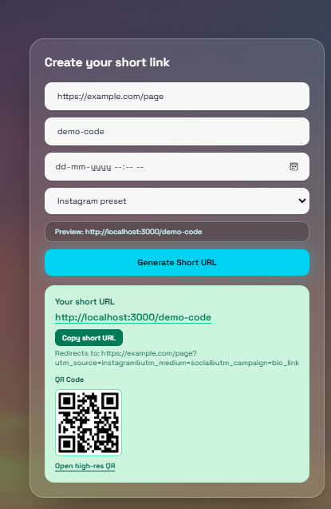

# URL Customizer

This repository contains the URL shortener project inside `url-shortner/`.

## Project Location

- App source: `url-shortner/`
- Project README: `url-shortner/README.md`

## Quick Start

```bash
cd url-shortner
npm install
npm run dev
```

Open `http://localhost:3000`.

## Screenshots

<table>
  <tr>
    <td align="center"><strong>Home Page</strong></td>
    <td align="center"><strong>Admin Dashboard</strong></td>
  </tr>
  <tr>
    <td></td>
    <td></td>
  </tr>
  <tr>
    <td align="center" colspan="2"><strong>QR Preview</strong></td>
  </tr>
  <tr>
    <td colspan="2"></td>
  </tr>
</table>
